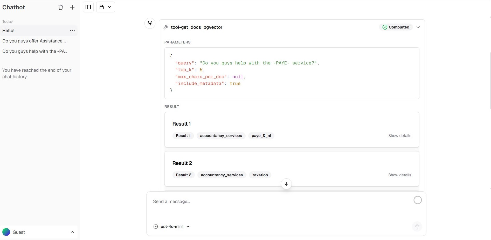

## Live Demo
- ### [Launch the app](https://frontend-d9fe.vercel.app)

## Problem This Template Solves
- Teams need one template that marries a scalable Python FastAPI microservice (built for LangGraph and LangChain agents) with a production-grade Next.js frontend.
- Wiring all of that from scratch takes a ton of time and expertise; Python-first teams often struggle to ship production-ready, scalable web frontends for their agents or multi-agent-systems.
- This starter gives you both halves ready to work together: the FastAPI backend handles LangGraph agents, and the Next.js frontend brings Vercel's polished auth/session system. Because both layers follow the AI SDK UI streaming protocols, they talk to each other smoothly without performance bottlenecks.
- Stack: Next.js 15, React 19 RC, Tailwind 4, SWR, Drizzle ORM, Vercel AI SDK (ui/core), Python 3.13+, FastAPI, LangGraph,  Docker.

## What I Added
- FastAPI microservice foundation is a modified version of Joshua Carroll's [agent-service-toolkit](https://github.com/JoshuaC215/agent-service-toolkit); the Next.js UI is a modified version of Vercel's [AI Chatbot template](https://github.com/vercel-labs/ai-chatbot), so we start with two proven projects.
- Reworked the FastAPI service to speak the [AI SDK UI stream protocol](https://ai-sdk.dev/docs/ai-sdk-ui/stream-protocol) for text, tool calls, and RAG artifacts.
- Replaced the Vercel's Ai Chatbot's server-side OpenAI calls with a server-side proxy so every browser request hops through Next.js to FastAPI, keeping headers, SSE, and auth intact.
- Wired the UI into FastAPI's history endpoint so existing chats hydrate correctly.
- Added UI support for streamed tool results with ai-sdk-ui components.
- Simplified chat title generation while leaving auth and database plumbing unchanged.
- Reference commit: [Click here for more technical details](https://github.com/AnsImran/productionReady-langgraph-fastapi-nextjs-template/commit/60566eb288bf2f400bcbe26b01eeddb8a0e0e3b9) (Next.js server-side proxy work landed afterwards).

## How to Use It
1. **Prerequisites**
   - Node 18+, pnpm 9+, Python 3.13+, Docker (optional but recommended).
   - A PostgreSQL database (Neon is great) plus LLM API keys.
2. **Environment**
   - Copy `.env.example` to `.env` and fill FastAPI settings (PG URL, LLM keys, etc.).
   - Copy `frontend/.env.example` to `frontend/.env.local` and repeat the PG URL etc keys.
   - By default the browser calls `/api/fastapi/*`, which the Next.js server proxies to `http://localhost:8080`. Adjust `FASTAPI_BASE_URL` if you host FastAPI elsewhere.
3. **Run Locally**
   - Backend: `docker compose up --build` from the repo root (or `uv sync && python src/run_service.py` if you prefer bare Python).
   - Frontend: `cd frontend && pnpm install && pnpm run dev`, then open `http://localhost:3000`.
   - In dev, FastAPI listens on `http://localhost:8080`, and the UI streams via `/api/fastapi/stream`.
4. **Customize the Agent**
   - Drop your LangGraph agent (or multi-agent graph) into `src/agents/<you-agent-here.py>`
   - Stream outputs with the AI SDK protocol so text, tools, and documents appear live.
   - Update frontend components if you add new UI types; the `frontend/components` folder already covers artifacts, history, votes, and usage data.
   - Use [AI Elements](https://ai-sdk.dev/elements/overview) for ready-made UI components.
5. **Deploy**
   - Host the frontend on Vercel, the FastAPI service on your cloud of choice.
   - Set `FASTAPI_BASE_URL` (server) to your FastAPI HTTPS URL.
   - In production you’d typically run a single Docker Compose (or equivalent orchestrated) stack that brings up Postgres, the Next.js app, and the FastAPI microservice inside a private network/VPC with a single ingress/egress for security.

## What's Next / How You Can Help
- Remove the remaining legacy Next.js code (old chat API handlers etc).
- Integrate the remaining legacy Next.js code paths (time-travel editing, JWT logic) with the FastAPI microservice—the feature work still needs coordinated updates across both apps.
- Ship a single docker-compose that brings up Postgres, FastAPI, and Next.js with seed data ready to go.
- Contributions welcome: add agent examples, improve docs/tests (Playwright and FastAPI), or share UI presets. Open a PR or start a discussion!
